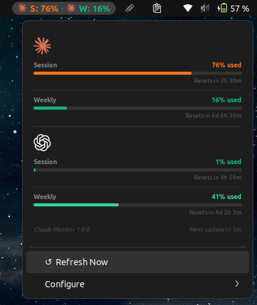

# Claude Monitor

> Track your Claude and Codex AI usage limits in real time — GNOME system tray on Linux, native menu bar app on macOS.


---

## Download

| Platform | Version | Download |
|----------|---------|----------|
| **macOS** (13 Ventura+) | v1.0.0 | [Claude.Monitor-Installer.dmg](https://github.com/CybrosysAssista/claude-monitor/releases/download/v1.0.0-macos/Claude.Monitor-Installer.dmg) |
| **Linux** — GNOME Shell 45–49 | v1.1.0 | [claudemonitor@assista.shell-extension.zip](https://github.com/CybrosysAssista/claude-monitor/releases/download/v1.1.0/claudemonitor%40assista.shell-extension.zip) |

---

## Install

### macOS

**Requirements:** macOS 13 (Ventura) or newer.

1. Download **`Claude.Monitor-Installer.dmg`** from the table above
2. Open the `.dmg` — drag **Claude Monitor.app** into `/Applications`
3. Launch from `/Applications`

> **First launch only — Gatekeeper bypass (app is not notarized):**
> - Right-click the app in Finder → **Open** → click **Open** in the dialog
> - Or: **System Settings → Privacy & Security → scroll down → Open Anyway**
>
> macOS remembers your choice for all future launches.

4. The menu bar entry appears immediately. Click it to see session and weekly breakdowns.

**Credentials:** On first launch, macOS will show keychain security prompts — one for each provider you have installed:

> *"Claude Monitor wants to access 'Claude Code-credentials' in your keychain."*
> *"Claude Monitor wants to access 'Codex Auth' in your keychain."*

Enter your **Mac login password** and click **Always Allow** for each — this grants permanent read access so the prompts never appear again.

If a keychain item isn't found (e.g. CLI not installed or older version), the app falls back to reading directly from the credential files:

| Provider | Keychain service | File fallback |
|----------|-----------------|---------------|
| Claude | `"Claude Code-credentials"` | `~/.claude/.credentials.json` |
| Codex | `"Codex Auth"` | `~/.codex/auth.json` |

If neither keychain nor file is found for a provider, that provider shows **→ Install CLI** in the menu.



---

### Linux (GNOME Shell)

**Requirements:** GNOME Shell 45–49 (Ubuntu 22.04, 24.04, Fedora 39+).

**From GitHub Releases:**

```bash
# Download claudemonitor@assista.shell-extension.zip from the table above, then:
gnome-extensions install --force claudemonitor@assista.shell-extension.zip

# Restart GNOME Shell:
# Wayland — log out and log back in
# X11     — Alt+F2 → type r → Enter

gnome-extensions enable claudemonitor@assista
```

**From source:**

```bash
git clone https://github.com/CybrosysAssista/claude-monitor.git
cd claude-monitor
bash scripts/dev/pack.sh
bash scripts/dev/install.sh
bash scripts/dev/enable.sh
```

**Credentials:** Written automatically by the CLI tools — no extra setup needed:

| Provider | File |
|----------|------|
| Claude | `~/.claude/.credentials.json` |
| Codex | `~/.codex/auth.json` |

Sign in once via `claude` or `codex` CLI — the monitor picks up the session automatically.

---

## Overview

Claude Monitor polls the Claude (Anthropic) and Codex (OpenAI) OAuth APIs every 3 minutes and displays live usage percentages without opening a browser. Session and weekly limits are tracked independently for each provider.

---

## Features

- **Live tray / menu bar indicator** — usage percentage always visible at a glance
- **Per-provider, per-window tracking** — session and weekly limits shown separately for Claude and Codex
- **5-level color scale** — green / emerald / yellow / orange / red, each tied to a specific threshold
- **9 configurable display modes** — overall minimum, per-provider, per-window, or all side by side
- **% used ↔ % left toggle** — flip the entire display; preference persists across restarts
- **Desktop notifications** — fires when any window drops below 20%, deduplicated per reset window
- **Manual refresh** — trigger an immediate poll from the popup / menu
- **Exponential backoff** — backs off gracefully on network errors or API rate limits (30 s → 15 min cap)
- **About menu** — version info, GitHub and Cybrosys Assista links
- **Install CLI links** — clickable links shown when credentials are missing

---

## Color thresholds

| Remaining | Color |
|-----------|-------|
| ≥ 80% | 🟢 Green |
| 50 – 79% | 🟩 Emerald |
| 30 – 49% | 🟡 Yellow |
| 15 – 29% | 🟠 Orange |
| < 15% | 🔴 Red |

---

## Panel / menu bar display modes

Open the popup → **Configure** to choose what the tray label shows:

| Mode | What it displays |
|------|-----------------|
| Overall (lowest %) | Single number — worst across all windows |
| All metrics | One label per window, side by side |
| Claude | Both Claude windows |
| Claude · Session | Claude session only |
| Claude · Weekly | Claude weekly only |
| Codex | Both Codex windows |
| Codex · Session | Codex session only |
| Codex · Weekly | Codex weekly only |
| None | Hides the tray label (popup still works) |

Toggle **Reversed (% left)** to flip between "% used" and "% left".

---

## Architecture

### macOS app

```
Sources/ClaudeMonitor/
  AppDelegate.swift            — app lifecycle, menu bar setup
  StatusBarController.swift    — NSStatusItem, popup window management
  main.swift                   — entry point
  Settings.swift               — UserDefaults: display mode, inverted toggle
  Backoff.swift                — exponential backoff for network errors
  Log.swift                    — unified logging
  NotificationManager.swift    — fires UNUserNotification below 20% threshold
  Providers/
    ClaudeProvider.swift       — keychain read → file fallback → OAuth refresh → usage fetch
    CodexProvider.swift        — keychain read → file fallback → OAuth refresh → usage fetch
    Keychain.swift             — SecItemCopyMatching wrapper (triggers macOS auth dialog)
    Credentials.swift          — reads ~/.claude/.credentials.json, ~/.codex/auth.json
    HTTPClient.swift           — URLSession async wrappers
    Models.swift               — ProviderResult, UsageSnapshot types
    Normalize.swift            — extracts remaining % from API response shapes
  UI/
    ProviderRowView.swift       — per-provider row (label + percentage + reset timer)
    SectionHeaderView.swift    — section separators
    LabelRenderer.swift        — formats menu bar label string
    Formatting.swift           — date/time helpers
    Colors.swift               — 5-level color thresholds
```

**Credential resolution order (macOS):**

| Provider | Keychain service | File fallback |
|----------|-----------------|---------------|
| Claude | `"Claude Code-credentials"` | `~/.claude/.credentials.json` |
| Codex | `"Codex Auth"` | `~/.codex/auth.json` |

Each provider tries keychain first, falls back to file, shows **→ Install CLI** link if neither is found.

### GNOME extension

```
extension.js                 — GNOME lifecycle, GObject UI, wires DI
extension/lib/
  core/
    scheduler.js             — polls providers every 180 s, serial queue per provider
    aggregate.js             — derives minRemainingPct across all providers
    state.js                 — per-provider state machine (OK / AUTH_EXPIRED / RATE_LIMITED / …)
    backoff.js               — exponential backoff: 30 s → 15 min cap on network errors / 429s
    notifications.js         — fires GNOME notify() below 20%, deduplicates per reset window
    normalize.js             — extracts remaining % from Claude / Codex API shapes
  providers/
    claude.js                — OAuth refresh + usage fetch → api.anthropic.com
    codex.js                 — OAuth refresh + usage fetch → chatgpt.com
  runtime/
    fetch.js                 — Soup 3.0 async HTTP wrapped in Promises
    fs.js                    — Gio async file read wrapped in Promises
  ui/
    render.js                — pure function: summary → view-model strings
extension/schemas/           — GSettings schema (display-inverted, panel-label-modes)
extension/icons/             — claude.svg, codex-symbolic.svg
test/unit/                   — bun:test unit tests, all I/O mocked via DI
```

---

## Development (GNOME extension)

```bash
npx bun test                              # run unit tests
bash scripts/dev/pack.sh                  # build claudemonitor@assista.shell-extension.zip
bash scripts/dev/install.sh               # install locally (runs pack if zip missing)
bash scripts/dev/enable.sh                # enable extension
journalctl --user -f /usr/bin/gnome-shell # live logs
```

> After any source change: `pack.sh` → `install.sh` → restart GNOME Shell (re-login on Wayland).

---

## Built by Cybrosys Assista

<a href="https://assista.cybrosys.com">
  
</a>

Claude Monitor is an open-source tool built and maintained by **[Cybrosys Assista](https://assista.cybrosys.com)** — an AI-powered toolkit ecosystem for developers, trusted by 4,000+ professionals globally.

- **Website:** [assista.cybrosys.com](https://assista.cybrosys.com)
- **Docs:** [docs.cybrosys.com](https://docs.cybrosys.com)
- **Contact:** assista@cybrosys.com

---

## License

MIT © 2026 Cybrosys Assista
